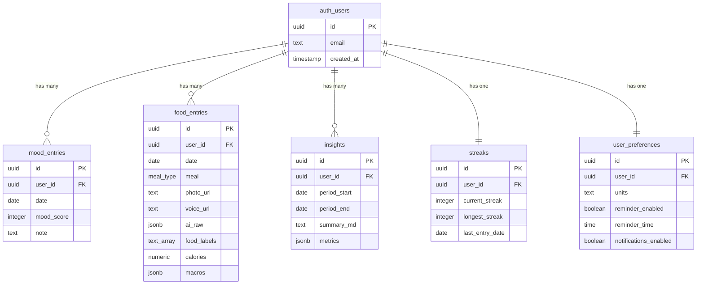

# 🗄️ Sofi Wellness - Database Schema Documentation

## Overview

This document outlines the complete PostgreSQL database schema for the Sofi Wellness application. The database is designed to support mood tracking, food logging, AI-powered insights, and user engagement features with comprehensive security through Row Level Security (RLS) policies.

## 📋 Table of Contents

1. [Database Extensions](#database-extensions)
2. [Custom Types](#custom-types)
3. [Core Tables](#core-tables)
4. [Indexes](#indexes)
5. [Row Level Security (RLS)](#row-level-security-rls)
6. [Database Functions](#database-functions)
7. [Triggers](#triggers)
8. [Storage Buckets](#storage-buckets)
9. [Sample Data](#sample-data)

---

## Database Extensions

Required PostgreSQL extensions for the application:

```sql
-- Enable UUID generation
CREATE EXTENSION IF NOT EXISTS "uuid-ossp";

-- Enable scheduled jobs (for cleanup tasks)
CREATE EXTENSION IF NOT EXISTS "pg_cron";
```

---

## Custom Types

### Enum Types

```sql
-- Meal type enumeration
CREATE TYPE meal_type AS ENUM ('breakfast', 'lunch', 'dinner', 'snack');

-- Units enumeration (used in TypeScript, enforced via CHECK constraint)
-- VALUES: 'metric', 'imperial'
```

---

## Core Tables

### 1. Users Table

**Note**: User management is handled by Supabase Auth (`auth.users` table). This table is automatically managed and includes:

```sql
-- Supabase Auth Users (reference only)
-- auth.users {
--   id: UUID PRIMARY KEY
--   email: TEXT UNIQUE
--   encrypted_password: TEXT
--   email_confirmed_at: TIMESTAMPTZ
--   created_at: TIMESTAMPTZ
--   updated_at: TIMESTAMPTZ
--   last_sign_in_at: TIMESTAMPTZ
--   raw_app_meta_data: JSONB
--   raw_user_meta_data: JSONB
--   is_super_admin: BOOLEAN
--   role: TEXT
-- }
```

### 2. Mood Entries Table

Primary table for daily mood tracking.

```sql
CREATE TABLE mood_entries (
    id UUID PRIMARY KEY DEFAULT gen_random_uuid(),
    user_id UUID NOT NULL REFERENCES auth.users(id) ON DELETE CASCADE,
    date DATE NOT NULL,
    mood_score INTEGER NOT NULL CHECK (mood_score >= 1 AND mood_score <= 5),
    note TEXT,
    created_at TIMESTAMPTZ DEFAULT NOW(),
    updated_at TIMESTAMPTZ DEFAULT NOW(),
    UNIQUE(user_id, date) -- One mood entry per user per day
);
```

**Field Descriptions:**
- `id`: Unique identifier for the mood entry
- `user_id`: Reference to the authenticated user
- `date`: Date of the mood entry (YYYY-MM-DD format)
- `mood_score`: Mood rating from 1 (very bad) to 5 (very good)
- `note`: Optional text note about the mood
- `created_at`: Timestamp when record was created
- `updated_at`: Timestamp when record was last modified

**Business Rules:**
- Each user can have only one mood entry per day (enforced by UNIQUE constraint)
- Mood score must be between 1 and 5 inclusive
- Deletion cascades when user is deleted

### 3. Food Entries Table

Primary table for food intake tracking with AI integration.

```sql
CREATE TABLE food_entries (
    id UUID PRIMARY KEY DEFAULT gen_random_uuid(),
    user_id UUID NOT NULL REFERENCES auth.users(id) ON DELETE CASCADE,
    date DATE NOT NULL,
    meal meal_type NOT NULL,
    photo_url TEXT,
    voice_url TEXT,
    ai_raw JSONB,
    food_labels TEXT[],
    calories NUMERIC,
    macros JSONB, -- {protein: number, carbs: number, fat: number}
    note TEXT,
    journal_mode BOOLEAN DEFAULT FALSE, -- Privacy flag
    created_at TIMESTAMPTZ DEFAULT NOW(),
    updated_at TIMESTAMPTZ DEFAULT NOW()
);
```

**Field Descriptions:**
- `id`: Unique identifier for the food entry
- `user_id`: Reference to the authenticated user
- `date`: Date of the food entry
- `meal`: Type of meal (breakfast, lunch, dinner, snack)
- `photo_url`: URL to uploaded food photo in Supabase Storage
- `voice_url`: URL to uploaded voice note in Supabase Storage
- `ai_raw`: Raw AI response data (GPT-4V or Gemini vision analysis)
- `food_labels`: Array of identified food items
- `calories`: Estimated calorie count
- `macros`: Nutritional breakdown as JSON `{protein: number, carbs: number, fat: number}`
- `note`: User-added text note
- `journal_mode`: Privacy flag to exclude from insights/exports
- `created_at`: Timestamp when record was created
- `updated_at`: Timestamp when record was last modified

**Business Rules:**
- Multiple food entries allowed per user per day (different meals)
- Journal mode entries are excluded from analytics and insights
- Either photo_url, voice_url, or manual entry (food_labels/calories) required

### 4. Insights Table

Stores AI-generated weekly/monthly wellness insights.

```sql
CREATE TABLE insights (
    id UUID PRIMARY KEY DEFAULT gen_random_uuid(),
    user_id UUID NOT NULL REFERENCES auth.users(id) ON DELETE CASCADE,
    period_start DATE NOT NULL,
    period_end DATE NOT NULL,
    summary_md TEXT,
    tips_md TEXT,
    metrics JSONB, -- {avgMood: number, kcalTotal: number, topFoods: string[], moodEntries: number, foodEntries: number}
    created_at TIMESTAMPTZ DEFAULT NOW(),
    UNIQUE(user_id, period_start, period_end) -- One insight per period per user
);
```

**Field Descriptions:**
- `id`: Unique identifier for the insight
- `user_id`: Reference to the authenticated user
- `period_start`: Start date of the analysis period
- `period_end`: End date of the analysis period
- `summary_md`: AI-generated summary in Markdown format
- `tips_md`: AI-generated tips and recommendations in Markdown
- `metrics`: Aggregated data as JSON
- `created_at`: Timestamp when insight was generated

**Metrics JSON Structure:**
```json
{
  "avgMood": 4.2,
  "kcalTotal": 12650,
  "topFoods": ["eggs", "salmon", "quinoa", "broccoli", "avocado"],
  "moodEntries": 7,
  "foodEntries": 21
}
```

### 5. Streaks Table

Tracks user engagement streaks for gamification.

```sql
CREATE TABLE streaks (
    id UUID PRIMARY KEY DEFAULT gen_random_uuid(),
    user_id UUID NOT NULL REFERENCES auth.users(id) ON DELETE CASCADE,
    current_streak INTEGER DEFAULT 0,
    longest_streak INTEGER DEFAULT 0,
    last_entry_date DATE,
    updated_at TIMESTAMPTZ DEFAULT NOW(),
    UNIQUE(user_id) -- One streak record per user
);
```

**Field Descriptions:**
- `id`: Unique identifier for the streak record
- `user_id`: Reference to the authenticated user
- `current_streak`: Current consecutive days with entries
- `longest_streak`: Historical best streak
- `last_entry_date`: Date of the most recent entry
- `updated_at`: Timestamp when streak was last updated

**Business Rules:**
- Streak increments when user makes mood or food entries on consecutive days
- Streak resets if user misses a day
- Automatically updated via database triggers

### 6. User Preferences Table

Stores user-specific application settings and preferences.

```sql
CREATE TABLE user_preferences (
    id UUID PRIMARY KEY DEFAULT gen_random_uuid(),
    user_id UUID NOT NULL REFERENCES auth.users(id) ON DELETE CASCADE,
    units TEXT DEFAULT 'metric' CHECK (units IN ('metric', 'imperial')),
    reminder_enabled BOOLEAN DEFAULT TRUE,
    reminder_time TIME DEFAULT '09:00:00',
    journal_mode_default BOOLEAN DEFAULT FALSE,
    notifications_enabled BOOLEAN DEFAULT TRUE,
    created_at TIMESTAMPTZ DEFAULT NOW(),
    updated_at TIMESTAMPTZ DEFAULT NOW(),
    UNIQUE(user_id) -- One preferences record per user
);
```

**Field Descriptions:**
- `id`: Unique identifier for the preferences record
- `user_id`: Reference to the authenticated user
- `units`: Measurement system preference (metric/imperial)
- `reminder_enabled`: Whether daily reminders are enabled
- `reminder_time`: Time of day for daily reminders (HH:MM:SS format)
- `journal_mode_default`: Default privacy setting for new entries
- `notifications_enabled`: Global notification preference
- `created_at`: Timestamp when preferences were created
- `updated_at`: Timestamp when preferences were last modified

**Business Rules:**
- Automatically created for new users via trigger
- Units must be either 'metric' or 'imperial'
- Default reminder time is 9:00 AM

---

## Indexes

Performance optimization indexes for efficient queries:

```sql
-- Mood entries indexes
CREATE INDEX idx_mood_entries_user_date ON mood_entries(user_id, date DESC);

-- Food entries indexes
CREATE INDEX idx_food_entries_user_date ON food_entries(user_id, date DESC);
CREATE INDEX idx_food_entries_meal ON food_entries(meal);

-- Insights indexes
CREATE INDEX idx_insights_user_period ON insights(user_id, period_start DESC);

-- Streaks indexes
CREATE INDEX idx_streaks_user ON streaks(user_id);
```

**Index Purpose:**
- `idx_mood_entries_user_date`: Fast retrieval of user's mood entries by date
- `idx_food_entries_user_date`: Fast retrieval of user's food entries by date
- `idx_food_entries_meal`: Filtering food entries by meal type
- `idx_insights_user_period`: Fast retrieval of user's insights by period
- `idx_streaks_user`: Fast lookup of user streak data

---

## Row Level Security (RLS)

All tables implement Row Level Security to ensure users can only access their own data.

### Enable RLS

```sql
ALTER TABLE mood_entries ENABLE ROW LEVEL SECURITY;
ALTER TABLE food_entries ENABLE ROW LEVEL SECURITY;
ALTER TABLE insights ENABLE ROW LEVEL SECURITY;
ALTER TABLE streaks ENABLE ROW LEVEL SECURITY;
ALTER TABLE user_preferences ENABLE ROW LEVEL SECURITY;
```

### RLS Policies

Each table has four standard policies (SELECT, INSERT, UPDATE, DELETE):

```sql
-- Example for mood_entries (pattern repeated for all tables)
CREATE POLICY "Users can view their own mood entries" ON mood_entries
    FOR SELECT USING (auth.uid() = user_id);

CREATE POLICY "Users can insert their own mood entries" ON mood_entries
    FOR INSERT WITH CHECK (auth.uid() = user_id);

CREATE POLICY "Users can update their own mood entries" ON mood_entries
    FOR UPDATE USING (auth.uid() = user_id);

CREATE POLICY "Users can delete their own mood entries" ON mood_entries
    FOR DELETE USING (auth.uid() = user_id);
```

**Security Benefits:**
- Complete data isolation between users
- Prevents unauthorized access even with valid authentication
- Database-level enforcement (cannot be bypassed by application logic)
- Automatic filtering of queries to user's own data

---

## Database Functions

### 1. Streak Update Function

Automatically maintains streak counters when entries are added:

```sql
CREATE OR REPLACE FUNCTION update_streak()
RETURNS TRIGGER AS $$
BEGIN
    INSERT INTO streaks (user_id, current_streak, longest_streak, last_entry_date, updated_at)
    VALUES (NEW.user_id, 1, 1, NEW.date, NOW())
    ON CONFLICT (user_id) DO UPDATE SET
        current_streak = CASE 
            WHEN streaks.last_entry_date = NEW.date - INTERVAL '1 day' OR streaks.last_entry_date = NEW.date THEN 
                CASE WHEN streaks.last_entry_date = NEW.date THEN streaks.current_streak 
                     ELSE streaks.current_streak + 1 END
            ELSE 1
        END,
        longest_streak = GREATEST(
            streaks.longest_streak, 
            CASE 
                WHEN streaks.last_entry_date = NEW.date - INTERVAL '1 day' OR streaks.last_entry_date = NEW.date THEN 
                    CASE WHEN streaks.last_entry_date = NEW.date THEN streaks.current_streak 
                         ELSE streaks.current_streak + 1 END
                ELSE 1
            END
        ),
        last_entry_date = NEW.date,
        updated_at = NOW();
    
    RETURN NEW;
END;
$$ LANGUAGE plpgsql;
```

### 2. User Preferences Creation Function

Automatically creates default preferences for new users:

```sql
CREATE OR REPLACE FUNCTION create_user_preferences()
RETURNS TRIGGER AS $$
BEGIN
    INSERT INTO user_preferences (user_id)
    VALUES (NEW.id);
    RETURN NEW;
END;
$$ LANGUAGE plpgsql;
```

### 3. Weekly Metrics Calculation Function

Calculates aggregated metrics for insights generation:

```sql
CREATE OR REPLACE FUNCTION calculate_weekly_metrics(user_uuid UUID, start_date DATE, end_date DATE)
RETURNS JSONB AS $$
DECLARE
    avg_mood NUMERIC;
    total_calories NUMERIC;
    top_foods TEXT[];
    mood_count INTEGER;
    food_count INTEGER;
BEGIN
    -- Calculate average mood
    SELECT AVG(mood_score), COUNT(*)
    INTO avg_mood, mood_count
    FROM mood_entries 
    WHERE user_id = user_uuid 
    AND date BETWEEN start_date AND end_date;
    
    -- Calculate total calories
    SELECT COALESCE(SUM(calories), 0), COUNT(*)
    INTO total_calories, food_count
    FROM food_entries 
    WHERE user_id = user_uuid 
    AND date BETWEEN start_date AND end_date
    AND journal_mode = FALSE; -- Exclude journal mode entries
    
    -- Get top foods
    SELECT ARRAY_AGG(food_label)
    INTO top_foods
    FROM (
        SELECT UNNEST(food_labels) AS food_label, COUNT(*) as frequency
        FROM food_entries 
        WHERE user_id = user_uuid 
        AND date BETWEEN start_date AND end_date
        AND journal_mode = FALSE
        AND food_labels IS NOT NULL
        GROUP BY food_label
        ORDER BY frequency DESC
        LIMIT 5
    ) AS top_food_query;
    
    RETURN jsonb_build_object(
        'avgMood', COALESCE(avg_mood, 0),
        'kcalTotal', COALESCE(total_calories, 0),
        'topFoods', COALESCE(top_foods, ARRAY[]::TEXT[]),
        'moodEntries', COALESCE(mood_count, 0),
        'foodEntries', COALESCE(food_count, 0)
    );
END;
$$ LANGUAGE plpgsql SECURITY DEFINER;
```

---

## Triggers

Automated database triggers for maintaining data consistency:

```sql
-- Update streaks when mood entries are added
CREATE TRIGGER mood_entry_streak_trigger
    AFTER INSERT ON mood_entries
    FOR EACH ROW EXECUTE FUNCTION update_streak();

-- Update streaks when food entries are added
CREATE TRIGGER food_entry_streak_trigger
    AFTER INSERT ON food_entries
    FOR EACH ROW EXECUTE FUNCTION update_streak();

-- Create default preferences for new users
CREATE TRIGGER create_user_preferences_trigger
    AFTER INSERT ON auth.users
    FOR EACH ROW EXECUTE FUNCTION create_user_preferences();
```

---

## Storage Buckets

File storage configuration for uploaded content:

### Required Buckets

1. **food-photos** (Private)
   - Purpose: Store food photos uploaded by users
   - Access: Authenticated users only (own files)
   - File Types: JPG, PNG, WebP
   - Max Size: 10MB per file

2. **voice-notes** (Private)  
   - Purpose: Store voice recordings uploaded by users
   - Access: Authenticated users only (own files)
   - File Types: M4A, MP3, WAV
   - Max Size: 25MB per file

### Bucket Policies

```sql
-- Food photos bucket policy (set via Supabase dashboard)
-- Allow authenticated users to:
-- - INSERT: Upload their own photos
-- - SELECT: View their own photos  
-- - UPDATE: Replace their own photos
-- - DELETE: Remove their own photos

-- Voice notes bucket policy (set via Supabase dashboard)
-- Allow authenticated users to:
-- - INSERT: Upload their own voice notes
-- - SELECT: Listen to their own voice notes
-- - UPDATE: Replace their own voice notes  
-- - DELETE: Remove their own voice notes
```

---

## Sample Data

### Example Mood Entry

```sql
INSERT INTO mood_entries (user_id, date, mood_score, note) VALUES 
('user-uuid-here', '2024-01-15', 4, 'Feeling good today! Got a good workout in.');
```

### Example Food Entry

```sql
INSERT INTO food_entries (
    user_id, date, meal, food_labels, calories, macros, note
) VALUES (
    'user-uuid-here', 
    '2024-01-15', 
    'breakfast',
    ARRAY['scrambled eggs', 'whole wheat toast', 'avocado'],
    420,
    '{"protein": 24, "carbs": 28, "fat": 18}'::jsonb,
    'Healthy breakfast with lots of protein'
);
```

### Example Insight

```sql
INSERT INTO insights (
    user_id, period_start, period_end, summary_md, metrics
) VALUES (
    'user-uuid-here',
    '2024-01-01',
    '2024-01-07', 
    '# Weekly Summary\n\nYou had a great week with consistent mood tracking!',
    '{"avgMood": 4.2, "kcalTotal": 12650, "topFoods": ["eggs", "salmon"], "moodEntries": 7, "foodEntries": 21}'::jsonb
);
```

---

## Data Relationships



---

## Performance Considerations

### Query Optimization
- All user-scoped queries use the user_id indexes
- Date range queries are optimized with DESC ordering
- JSONB fields use GIN indexes where needed for complex queries

### Scaling Considerations
- Partition large tables by date if data volume grows significantly
- Consider archiving old insights and mood entries
- Monitor query performance and add indexes as needed

### Security Best Practices
- All tables protected by RLS policies
- Sensitive data encrypted at rest (handled by Supabase)
- File uploads use signed URLs with expiration
- Regular security audits of RLS policies

---

## Migration Strategy

### Initial Setup
1. Run the complete migration script (`000_init.sql`)
2. Set up storage buckets via Supabase dashboard
3. Configure bucket policies for authenticated access
4. Test RLS policies with sample data

### Future Migrations
- Use numbered migration files (001_*, 002_*, etc.)
- Always include rollback procedures
- Test migrations on staging environment first
- Backup database before production migrations

---

## Database Maintenance

### Regular Tasks
- Monitor query performance and optimize slow queries
- Review and update RLS policies as features evolve
- Clean up orphaned files in storage buckets
- Archive old data based on retention policies

### Backup Strategy
- Automated daily backups (handled by Supabase)
- Point-in-time recovery available
- Regular backup restoration testing
- Export critical data for external backup

---

**Last Updated**: $(date)  
**Schema Version**: 1.0.0  
**Database**: PostgreSQL 15+ (Supabase)  
**Application**: Sofi Wellness v1.0.0